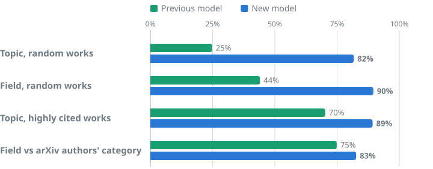
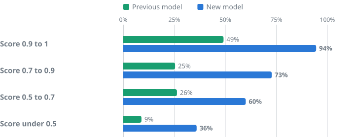

# OpenAlex topic classification, version 2

How [OpenAlex](https://openalex.org) decides what a work is about. Every work gets up to three of OpenAlex's
**4,516 topics**, and each topic sits in a subfield, a field and a domain. In October 2026 OpenAlex switches every
work's topics to the model in this folder. This is **version 2.0.0** (see the [changelog](CHANGELOG.md)); version 1,
the model it replaces, is in [v1/](../v1/).

**The topics themselves do not change.** Same 4,516 topics, same names, same keywords, same hierarchy, same IDs. Only
the assignments of topics to works change, and they get far more accurate.

> **Everything is here:** the code, the model weights, the 2 million teacher labels the model learned from, every
> test set and every judge's answer, so you can check our numbers or build something better.

## Benchmarks

**On random works, the new model picks the right topic 82% of the time. The previous model picked it 25% of the
time.**



**What right means.** Two frontier AI models from different labs, Claude Opus 5.5 and GPT-6.1 Sol, each read a work
and chose its topic from the whole taxonomy, blind to each other and to every model being tested. Where they agree,
that is the answer. We drew a fresh test set of 2,000 random works and 200 highly cited ones (the top 1% by
citations), used none of it to build or tune anything, and scored it once. The two judges agreed on 1,503 of the
random works and 168 of the cited ones; those are the numbers above. At the field level (26 fields), the new model is
right 90% of the time and the previous one 44%.

**On evidence no model produced, the gap holds.** When authors post a paper to arXiv they choose its category. On
1,984 random arXiv papers, the field of the new model's topic matches the authors' category 83% of the time, against
75% for the previous model.

**Its scores mean what they say.** Each topic comes with a score. The new model's score is a calibrated probability:
when it says 0.9 or more (64% of works), it is right 94% of the time. The previous model's scores carried little
information: its answers scored 0.9 or more were right 49% of the time.



The full test table, with the teacher the model learned from and the parts of the pipeline on their own:

| Method (test set, primary topic) | Random works | Field, random works | Calibration error | Highly cited works |
|---|---|---|---|---|
| Previous OpenAlex topic model (v1) | 24.8% | 44.0% | 0.271 | 70.2% |
| Retriever alone (top 1) | 48.7% | 69.6% | | 63.7% |
| Jev alone, 255 candidates | 70.5% | 81.8% | 0.033 | 79.8% |
| **New model (v2)** | **81.7%** | **89.6%** | **0.047** | **89.3%** |
| Teacher: Claude Opus 5.5 choosing from a shortlist | 86.7% | 92.1% | 0.214 | 93.5% |

The gains are largest where the previous model was weakest: on works without an abstract (75% right, from 20%) and on
works not in English (72%, from 9%). Every sub-benchmark, the method and the intervals are in
[benchmarks/](benchmarks/README.md).

## What changed

- **Assignments.** The new model reads a work's title, abstract and venue and scores all 4,516 topics at once. A
  work's topics are its three highest, in order; the first is the primary topic, which sets the subfield, field and
  domain as before.
- **Scores.** `topics[].score` is now the model's probability for that topic, so it can be used as a confidence.
- **Not classifiable.** Some records have nothing to classify: a table of contents, an index, a bare file name. The
  new model says so, and those works get no topic. The previous model gave them a topic anyway; works whose text it
  could not read all got the same one, so 20.6 million works carry "Military Technology and Strategies".
- **Everything computed from topics moves with them.** Counts of works per topic, subfield, field and domain change,
  and so do field-normalized citation impact (FWCI) and citation percentiles, which compare a work with others in its
  primary topic's subfield.

## How it works

**A frontier model labels 2 million works; a smaller open model learns to copy it and labels the rest.**

1. **Retrieve.** A small encoder ([multilingual-e5-base](https://github.com/microsoft/unilm/tree/master/e5),
   fine-tuned on 72,267 works) ranks every topic for a work and keeps the top 255. See [shortlist/](shortlist/).
2. **Shortlist.** [Jev](https://typesafe.ai), a decision model from TypeSafe AI, gives each of the 255 a probability;
   every topic at 0.02 or more makes the shortlist (7 on average). The right topic is in it 97% of the time.
3. **Teach.** Claude Opus 5.5 (Anthropic) reads the work and picks one topic from the shortlist, or says that none
   fits or that the record is not classifiable. The prompt is in [teacher/prompt.md](teacher/prompt.md). It labelled
   1 million works sampled to cover every script, language, era and work type, then a second million chosen to fill
   the rarest topics. About 1% of works were labelled by a fallback model when Opus 5.5 declined.
4. **Learn.** [Qwen3-8B](https://github.com/QwenLM/Qwen3) with a classification head is fine-tuned on the 2 million
   labels. It reads only the work: no retrieval, no Jev and no frontier model at run time. See [student/](student/).
5. **Tag.** The model tags all of OpenAlex's works on GPUs (vLLM, FP8 weights, about 300 works a second per H100) and
   every new work each night.

Each choice (the teacher, its effort setting, the shortlist rule, the student's size and recipe) was made on a
separate development set; the test set was read once, after the model was final.

## Known issues

- **Rare topics.** The model keeps 94% of its teacher's accuracy overall, and less on topics the teacher rarely
  chose. 14 topics never got a single teacher label, so the model never assigns them; all are vague catch-alls such as
  "Diverse Global Research Studies" ([list](benchmarks/README.md#rare-topics)).
- **The answer key is made by models.** No human labelled the test set. The two judges come from different labs and
  agree on 75% of random works; we report the works where they agree, and the rest separately
  ([benchmarks/](benchmarks/README.md#the-answer-key)). Where they disagree, a third model breaks the tie, and it comes
  from the same lab as the teacher.
- **Only the primary topic is benchmarked.** The second and third topics are the model's next answers, often with low
  probabilities.
- **Texts change.** The model read titles and abstracts as they were in September and October 2026. A work whose
  abstract arrives later keeps its topic until it is tagged again.

## Use it

Filter or group any search by topic in the [API](https://api.openalex.org/works?filter=primary_topic.id:T10017) or
on [openalex.org](https://openalex.org/works?filter=primary_topic.id:T10017):

```
https://api.openalex.org/works?search=coral%20bleaching&group_by=primary_topic.id
https://api.openalex.org/works?filter=primary_topic.field.id:fields/17,publication_year:2025&group_by=primary_topic.id
```

To tag your own text with the same model, use the [aboutness endpoint](https://help.openalex.org/api/tag-aboutness/)
or run the weights yourself ([REPRODUCE.md](REPRODUCE.md#tag-your-own-works)).

## Reproduce it

```
python3 eval/test_read.py      # the test table above, from the files in data/ (standard library, 1 s)
```

[REPRODUCE.md](REPRODUCE.md) rebuilds the answer key, every benchmark and both charts from the files here, re-runs
the released model on the test set, and walks through relabelling, retraining and re-judging for anyone with the API
keys and GPUs.

## License and credits

Code: [MIT](../LICENSE). Data: CC0, like everything in OpenAlex. Model weights: Apache-2.0, like Qwen3, which they are
fine-tuned from. Teacher labels by Claude Opus 5.5, with Claude Opus 5 and GPT-6 Astra where Opus 5.5 declined;
judging by Claude Opus 5.5, GPT-6.1 Sol and Claude Fable 5.1; shortlists by Jev (TypeSafe AI). The retriever is
fine-tuned from multilingual-e5-base (Wang et al., MIT license).
